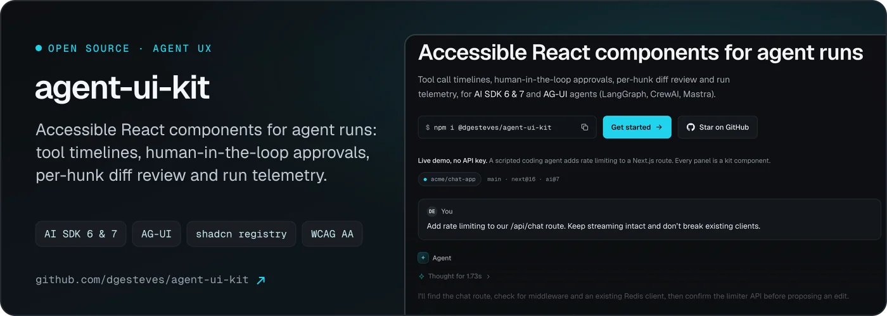
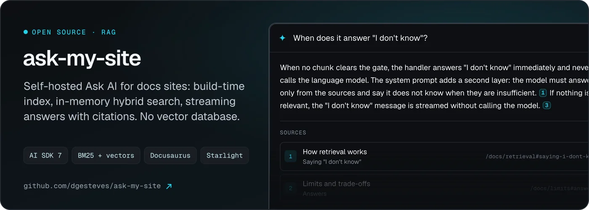
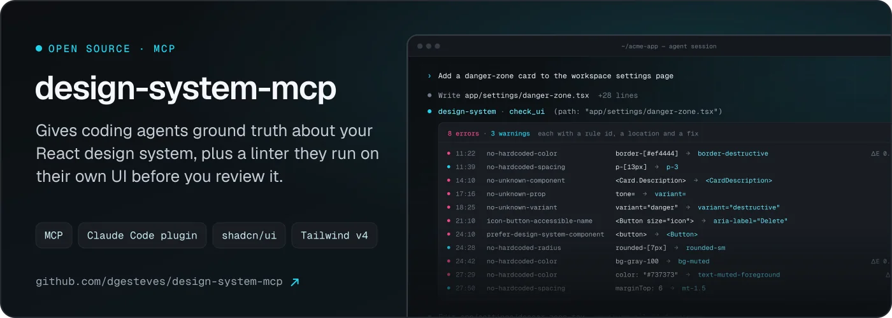
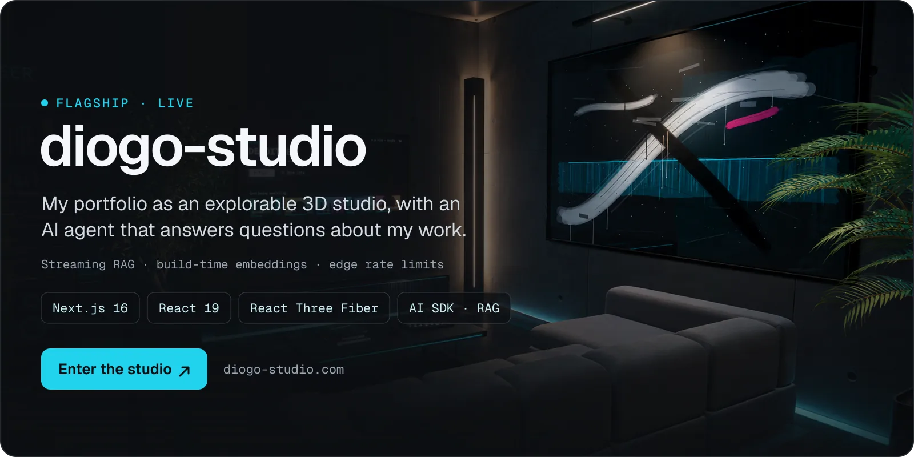
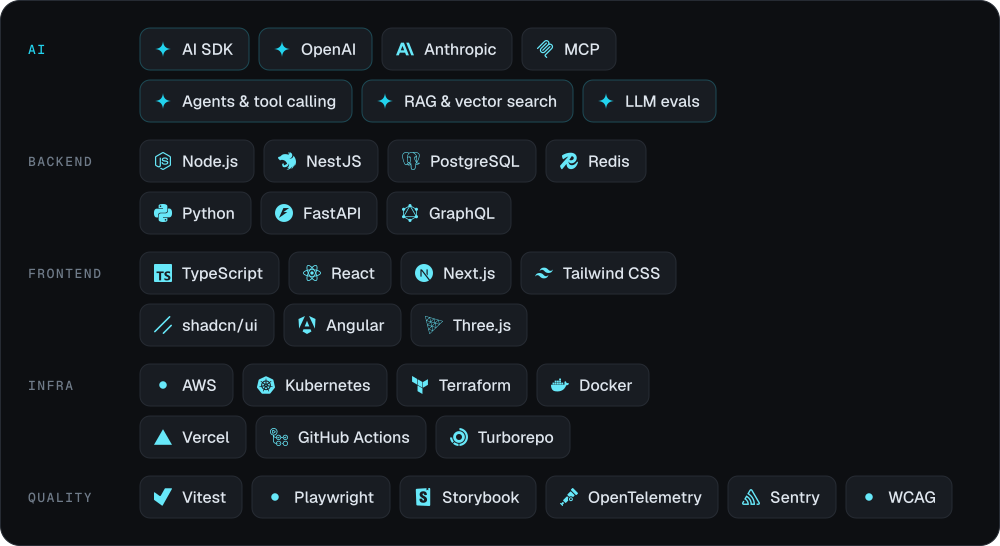

  &nbsp;
  &nbsp;
  

Full-stack engineer, 11+ years in, focused on AI. I build AI products end to end: agents and retrieval, the APIs and data behind them, and the interfaces people use. I've run engineering as VP at an AI-first startup, built a design system adopted across Fortune 1000 governance software, and shipped streaming UI to millions of Peacock subscribers. I'm equally at home as a Staff IC inside a large org or leading engineering at an AI startup. Lisbon-based, remote on US-aligned hours.

### Now

- **[Fueled](https://fueled.com)**: Lead Engineer, Web Applications. Leading architecture for enterprise web applications.
- **Open source**: AI developer tooling, built in public. Three projects below.

### Open source

Live demos: [agent-ui-kit playground](https://agent-ui-kit-demo.vercel.app) · [ask-my-site docs assistant](https://ask-my-site-demo.vercel.app)

### Featured

### Track record

**GrowthLnk** · *Founder* 
AI-powered co-founder for early-stage startups: one place to build, grow and raise funding.

**eino.ai** · *Lead Frontend Engineer* 
Agentic digital-twin platform for designing 5G, Wi-Fi and private-wireless networks. Map-based twins, real-time RF heatmaps and agent orchestration turn days of proposal work into seconds.

**Moment** · *VP of Engineering* 
Technical vision, architecture, hiring bar and leveling for an AI-first knowledge-intelligence platform.

**Diligent** · *Lead Frontend Engineer* 
Company-wide design system spanning React and Angular, adopted by GRC products used across a large share of the Fortune 1000.

**Sky · Peacock (NBCUniversal)** · *Senior Software Engineer* 
React and Redux at multi-million-user streaming scale. Performance, reliability and release safety on surfaces where regressions show up in minutes.

**BMW Group** · *Lead Frontend Engineer* 
Crowd and Open Innovation platforms feeding BMW's future-mobility and connected-vehicle R&amp;D.

### Stack

### Activity

<picture>
  <source media="(prefers-color-scheme: dark)" srcset="https://raw.githubusercontent.com/dgesteves/dgesteves/output/snake-dark.svg">
  <source media="(prefers-color-scheme: light)" srcset="https://raw.githubusercontent.com/dgesteves/dgesteves/output/snake-light.svg">
  
</picture>

### Beyond code

Founder of **WebDevPortugal**, a community for web engineers across Portugal (2019 to today). Co-founder of **Northern Grade E-Sports**, which helped young Portuguese players compete internationally. Member of GDG Lisbon.

---

**Open to** Staff+, Principal and Founding Engineer roles (full-stack and AI) at AI-native product companies, and Head / VP of Engineering at seed to Series B AI startups. Say hi at [diogo.esteves.goncalves@gmail.com](mailto:diogo.esteves.goncalves@gmail.com).
